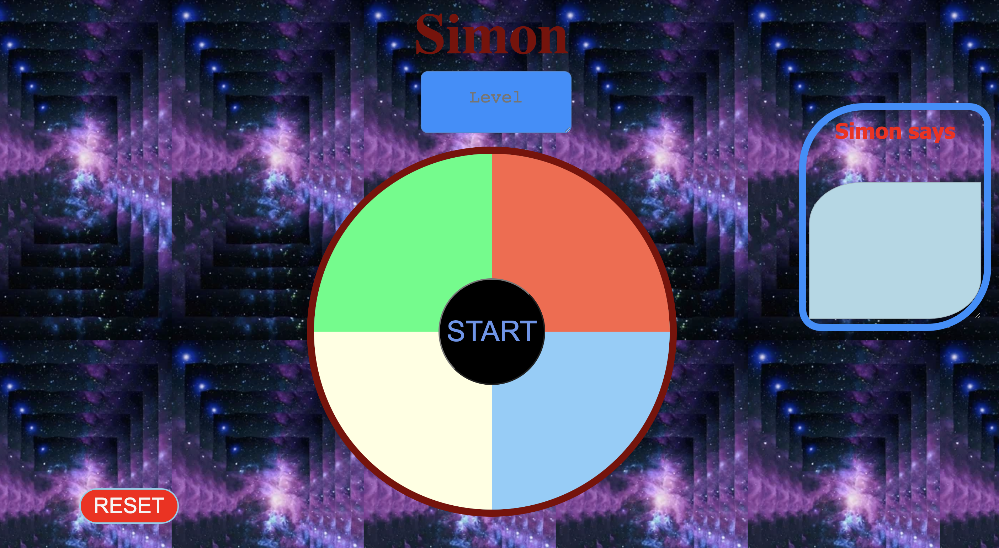
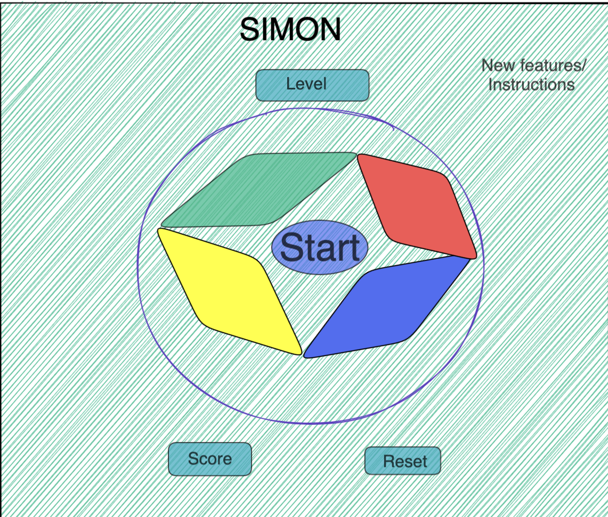

### Simon Game

## Description 
Simon game instructs the player to follow the sequence of flashing buttons. To move to the next level the player must click the four colored buttons as Simon says. As a player identifies the pattern correctly, he/she moves to the next level and each evel of the game gets harder.

## Technologies Used 
<ul>
<li> Visual Studio Code</li>
<li> Google Chrome</li>
<li> GitHub</li>
<li> JavaScript</li>
<li> HTML</li>
<li> CSS</li>
</ul>

## Actual game

## Basic User stories
<ul>
<li> As a user, I want to click the flashing buttons as Simon said.</li>
<li> As a user, I want to see the color changes properly.</li>
<li> As a user, I want to click the reset button if I clicked an invalid or wrong buttons.</li>
<li> As a user, I should know when I win or lose the game.</li>
</ul>

## How to play the game
<ul>
<li> To start the game the player must click start button.</li>
<li> Then after click the button exactly the same as Simon. </li>
<li> The order really matters, so the player must click the buttons in the same order.</li>
<li> If the player wrongly clicks the  button, he/she can click the reset button to start a new game before time expires.</li>
</ul>

## When does the player loses the game?
<ul>
<li> The player loses the game when clicking the wrong button.</li>
<li> The player loses the game when he/she didn't click the buttons before time expires. </li>
<li> The player must refresh browser if he/she loses the game, because the winner celebrates by disabling all the buttons. </li>
</ul>

## When does the player win the game?
<ul>
<li> The player wins the game when clicking the buttons, as Simon says.</li> 
<li> The player wins when completing all the 10 levels. </li> 
</ul>

## MVP Goals
<ul>
<li> As a user, I need to be able to click the start button to begin the game. </li>
<li> As a user, I need to be able to click the buttons after I see the buttons flashing.</li>
<li> As a user, I need to be able to click the reset button to restart the game. </li>
<li> As a user. I need to know the result on the screen when I win the game.</li>
</ul>

 ## Wireframes 
 ## Welcome Page

 ## Getting Started 

Links to GitHub Repository : https://github.com/BISrat3/Project1_Simon.git 

## Installation Instructions
<ul> 
<li> Download and install Visual Studio Code</li> 
<li> Fork and Clone the repository https://github.com/BISrat3/Project1_Simon.git </li>
<li> Right click to Open file "index.html" in Visual Studio Code.</li>
</ul>

 ## Future Goals
I will enhance the game by allowing more players to simultaneously play the game and by adding audio at each level. 

